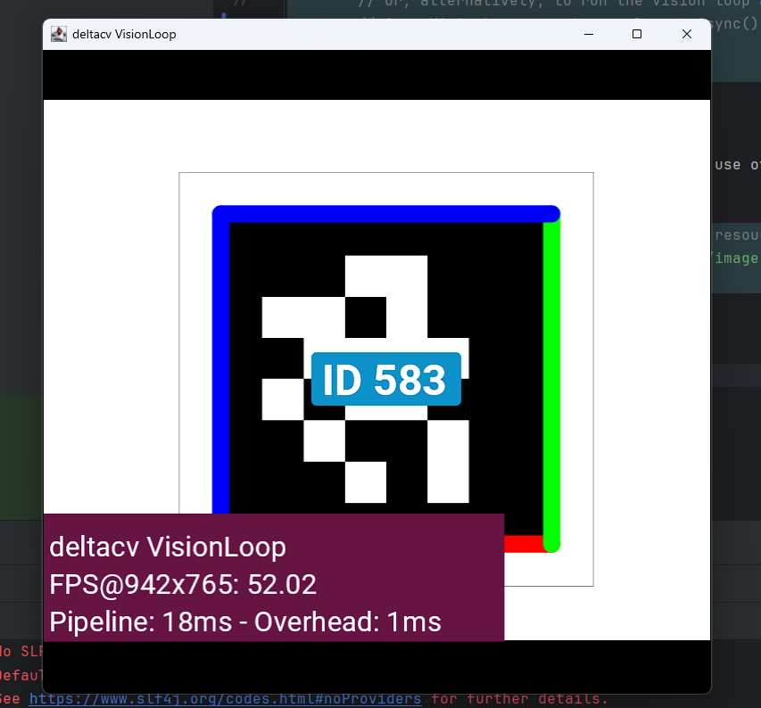

# VisionLoop

VisionLoop is a simple, flexible, and intuitive framework for processing vision data in real-time applications for the Java Virtual Machine. Designed for robotics and computer vision tasks, this API simplifies the integration of image sources, processing pipelines, and user interactions.

## Features

- **Fluent Interface**: Build complex configurations easily with method chaining.
- **Flexible Configuration**: Configure image sources from various inputs and processing parameters dynamically.
- **Event Handling**: Easily respond to user interactions like viewport taps.
- **Asynchronous Execution**: Run vision loops without blocking the main thread.
- **Testable**: Designed with testability in mind, making unit testing straightforward.

## Getting Started

### Prerequisites

- Java 11 or higher
- A build tool (e.g. Gradle, Maven)

### Installation

Add the following dependency to your project:

#### Gradle 

```groovy
repositories {
    mavenCentral()
    maven { url 'https://jitpack.io' }
}

dependencies {
    implementation 'com.github.deltacv:visionloop:1.0.0'
}
```

#### Maven

```xml
<repositories>
    <repository>
        <id>jitpack.io</id>
        <url>https://jitpack.io</url>
    </repository>
</repositories>

<dependency>
    <groupId>com.github.deltacv</groupId>
    <artifactId>visionloop</artifactId>
    <version>1.0.0</version>
</dependency>
```

### Usage

Here’s a quick example of how to set up a vision loop with an image source and an AprilTag processor:

```java
import io.github.deltacv.visionloop.AsyncVisionLoop;
import io.github.deltacv.visionloop.VisionLoop;
import org.firstinspires.ftc.vision.apriltag.AprilTagProcessor;
public class VisionLoopShowcase {
    public static void main(String[] args) {
        VisionLoop loop = VisionLoop.withWebcamIndex(0)
                .then(AprilTagProcessor.easyCreateWithDefaults()) // Use an AprilTag processor to detect tags
                .then((image) -> {
                    // Inline processing, image is a Timestamped<Mat> object.
                    // do some other stuff...
                    return image.getValue(); // Return the image to pass it to the next processor
                })
                .onViewportTapped(() -> System.out.println("Tapped!")) // Print a message when the viewport is tapped
                .withLiveView() // Enable the live view to see the processed image in a window
                .build(); // Build the vision loop

        loop.runBlocking(); // Run the vision loop on this thread

        // or, alternatively, to run the vision loop asynchronously:
        // AsyncVisionLoop asyncLoop = loop.toAsync();
        // asyncLoop.run();
    }
}
```

VisionLoop provides a few other methods to use other input sources...

```java
// Image can be both a path to an image file or resource from the classpath
VisionLoop loop = VisionLoop.withImage("path/to/image.jpg")
    //...
    .build();
```

### Result

